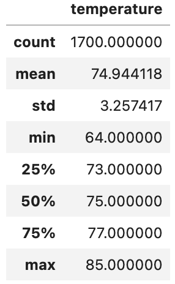
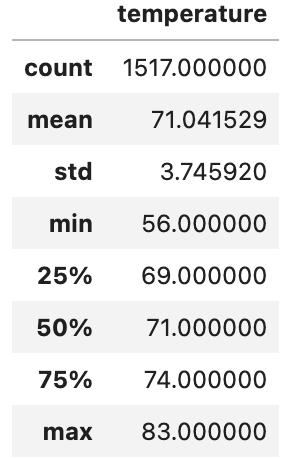

# surfs_up

## Overview

In this analysis we are accessing a weather database, stored in *hawaii.sqlite*, to determine the viability of opening a surf and ice cream shop business in Oahu, Hawaii. We aim to use the weather database to analyze the weather in Ohahu for the months of June and December. Our goal is to uncover any insights through querying the database and providing a brief statistical statistical summary, in order to assess the year-round sustainability of the porspective business.  

## Results

### __Key Differences in June & December Weather__

After querying the *hawaii.sqlite* database for weather records made in June and December, we performed summary statistics (provided in the tables below) for each month. Between the two months there were a few key differences:

- The largest difference was in the minimum temperatures with December being a full 8 degrees colder than the minimum temperature in June. This may indicate that evening's and mornings are cooler in December, which may or may not affect the optimal business hours seasonally.
- Beneficially, the maximum temperatures only show a difference of 2 degrees. Maximum temperature in june is 85 degrees, meanwhile it is still 83 degrees in December. This is promising because that means it will still be plenty warm for ice cream in the cooler months, which may allow better year-round sustainability of the shop.
- Despite a 4 degree difference in both mean and median measurements, both June and December mean and median temperatures stay above 70 degrees. Again, a positive indication for year-round sustainability of the surf and ice cream shop.

__June Temperature Summary Statistic__ <br>


__December Temperature Summary Statistics__ <br>


## Summary

Ultimately, a brief summary statistical analysis indicates a positive conclusion for assessing year-round sustainability of the surf and ice cream shop. The minimum, maximum, mean, and median temperatures show a neglible difference for the months of June and December, and are conducive for year-round surfing and ice cream consumption across in both times of the year.

Below are two additional queries to perform to further analyze the weather data for June and December. With these queries we can look at precipitation data from the *hawaii.sqlite* database.

__Precipitation Data (Precipitation Amount Records) in June & December:__

*June*
```python
result = session.query(Measurement.date, Measurement.prcp).filter(extract('month', Measurement.date) == 6).all()
```

*December*
```python
result = session.query(Measurement.date, Measurement.prcp).filter(extract('month', Measurement.date) == 12).all()
```

__Precipitation Statistics (Minimum, Average, Maximum) in June & December:__

*June*
```python
result3 = session.query(*[func.min(Measurement.prcp), func.avg(Measurement.prcp), func.max(Measurement.prcp)]).filter(extract('month', Measurement.date) == 6).all()
```

*December*
```python
result3 = session.query(*[func.min(Measurement.prcp), func.avg(Measurement.prcp), func.max(Measurement.prcp)]).filter(extract('month', Measurement.date) == 6).all()
```